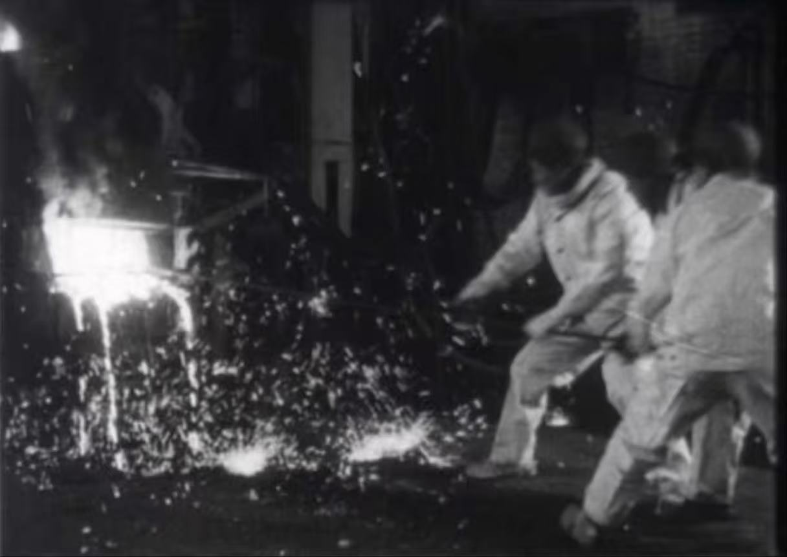
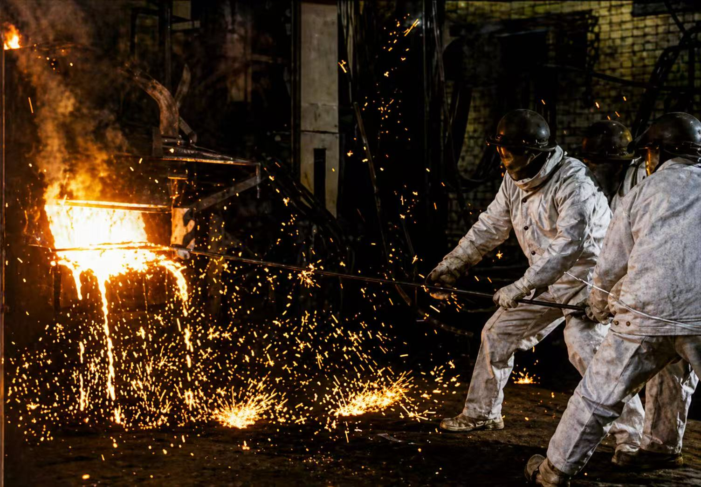
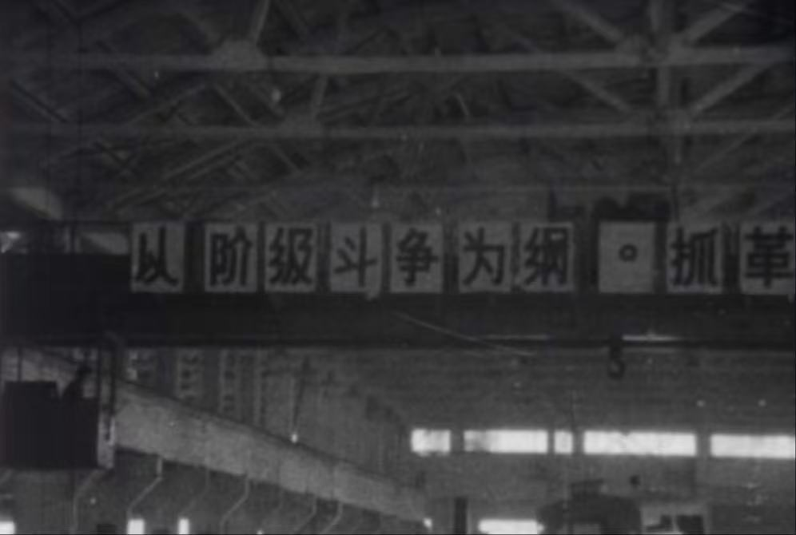
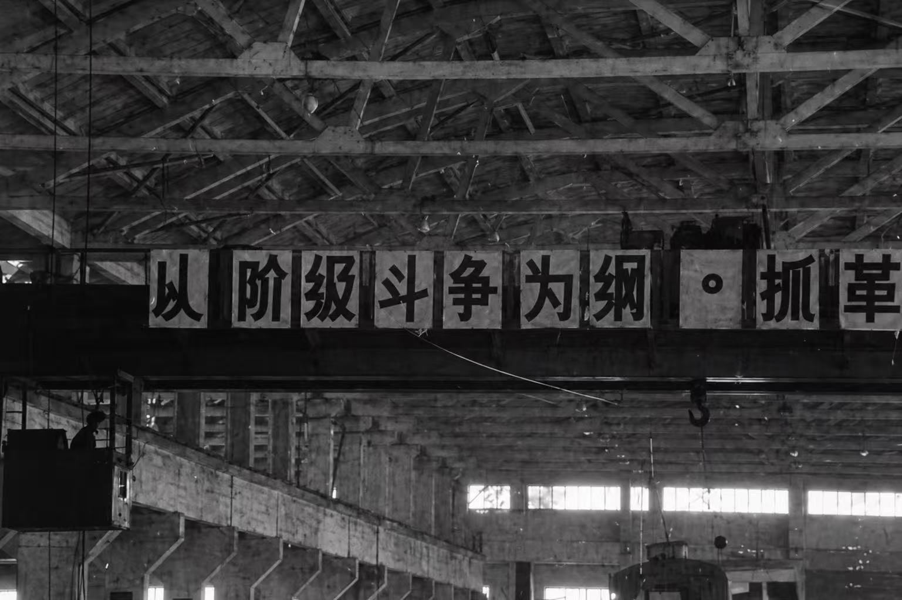
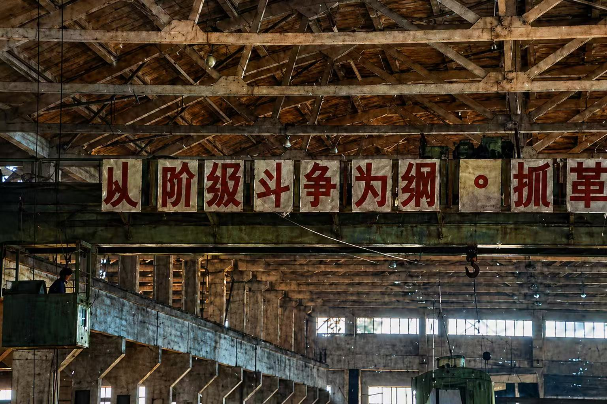

# 8.75mm AI-Assisted Film Restoration Workflow

This repository documents an experimental workflow for AI-assisted restoration and colorization of 8.75mm archival film footage. The project was developed as a small-scale test for a 10-second sample, but the workflow can be extended to longer clips if needed.

The purpose of this repository is not to claim that AI output is a preservation master. Instead, it records a practical process for creating an access copy or demonstration version from digitized rare-gauge film material.

## Why GPT-Image-2 Matters for Film Restoration

This project uses GPT-Image-2 as an experimental image-editing model for archival film restoration and colorization. According to OpenAI’s model documentation, GPT-Image-2 is a state-of-the-art image generation model for “fast, high-quality image generation and editing,” and it supports “flexible image sizes and high-fidelity image inputs.” These features are important for film restoration experiments because the workflow does not start from a blank image. It begins from an existing film frame, and the model is asked to edit, clean, and colorize that frame while keeping the original structure. OpenAI also describes ChatGPT Images 2.0 as having improved instruction following and stronger handling of detailed visual outputs. For this project, that means the model can follow stricter restoration rules more reliably than earlier image models, although the result still needs human review. [oai_citation:0‡OpenAI开发者](https://developers.openai.com/api/docs/models/gpt-image-2?utm_source=chatgpt.com)

Compared with earlier image-generation workflows, GPT-Image-2 provides a more useful direction for archival film work because it can operate through controlled image editing rather than pure image generation. Earlier models often treated a damaged frame almost like a new image prompt. This could produce attractive results, but it also increased the risk of visual invention. Faces, clothing, background objects, and film texture could shift from frame to frame. In contrast, this workflow uses GPT-Image-2 with strict prompts that limit the model’s freedom. The goal is not to make a “better-looking” image in a general sense, but to create a controlled access copy that remains visually tied to the source frame.

For rare-gauge film, this opens a new practical direction. Formats such as 8.75mm often do not have mature commercial restoration pipelines. If a digitized frame is scratched, unstable, or difficult to read, an image-editing model can be used to test frame-level reconstruction. However, this reconstruction must be bounded by rules. In this repository, the prompt repeatedly instructs the model not to change composition, faces, body shapes, clothing, background objects, camera angle, or historical texture. The model is allowed to reduce dust, scratches, and stains, and it may add restrained color only within a conservative historical palette.

This distinction is important for archival ethics. AI-assisted reconstruction is not neutral restoration. It is an interpretive layer added on top of the scan. The model can make damaged images more visible, but it can also introduce false details. Therefore, the method should be documented as a controlled workflow: the original scan is preserved, the AI-processed frames are labeled as derivatives, and the prompts are recorded as part of the technical and ethical metadata.

In this sense, GPT-Image-2 does not simply provide a faster way to colorize film. It allows a new kind of restoration experiment: rule-based visual reconstruction. The model can help test how much missing or damaged visual information can be made legible, but only when the project defines clear limits. For this repository, those limits are part of the method itself.



**Figure 1.** Original still image, black and white frame from the 8.75mm source scan.



**Figure 2.** AI-assisted black-and-white restoration using GPT-Image-2.



**Figure 3.** Original still image before colorization.



**Figure 4.** AI-assisted black-and-white restoration using GPT-Image-2.



**Figure 5.** AI-assisted colorized frame using GPT-Image-2.

## Project Context

8.75mm film is a rare and non-standard motion picture gauge associated with Chinese film exhibition and distribution history. Because this format is not widely supported by contemporary commercial scanners or post-production systems, digitized samples often require experimental workflows.

This repository focuses on a short test clip. The basic idea is:

1. Extract video frames from a scanned 8.75mm film clip.
2. Use an AI image-editing model to process each frame.
3. Apply conservative restoration and optional subtle colorization.
4. Reassemble the processed frames into a video.
5. Create a side-by-side comparison video for evaluation.

## Important Archival Note

The AI-generated result should be understood as an access or demonstration copy. It should not replace the original film, the raw scan, or any preservation master.

AI-assisted restoration can change visual information. It may remove details, invent textures, alter colors, or create temporal inconsistency between frames. For this reason, all AI-processed outputs should be clearly labeled.

Author Suggested label:

> AI-assisted restoration and colorization for access and demonstration purposes. This version should not be treated as a preservation master.

## Tested Environment

This workflow was tested on macOS using Terminal, Python, FFmpeg, and the OpenAI Images API.

Basic tools:

- macOS
- Homebrew
- FFmpeg
- Python 3
- OpenAI Python SDK
- Pillow
- tqdm

## Installation

### 1. Install Homebrew

If Homebrew is not installed, install it first from the official Homebrew website.

### 2. Install FFmpeg

```bash
brew install ffmpeg
```

Check installation:

```bash
ffmpeg -version
```

### 3. Create a Python virtual environment

From the project folder:

```bash
python3 -m venv .venv
source .venv/bin/activate
```

### 4. Install Python dependencies

```bash
pip install openai pillow tqdm
```

### 5. Set OpenAI API key

```bash
export OPENAI_API_KEY="your_api_key_here"
```

**Do not share your API key with others!!!**

## Folder Structure

I create many different clips, so my structure can look a bit chaotic. If you have other ideas, you can change my structure; this is a public instance.

```text
875mm_ai_restoration/
├── input/
│   └── input.mp4
├── frames_raw/
├── frames_restored/
├── frames_color_10s/
├── logs/
├── output/
├── scripts/
│   ├── restore_frames_test.py
│   └── colorize_10s_gptimage2.py
└── README.md
```

## Step 1: Extract Frames from the Source Video

Place the source video in:

```text
input/input.mp4
```

Extract frames at 24 frames per second:

```bash
mkdir -p frames_raw

ffmpeg -i input/input.mp4 -vf fps=24 frames_raw/frame_%04d.png
```

Check the number of frames:

```bash
ls frames_raw | wc -l
```

For a 10-second clip at 24 fps, the expected number is approximately:

```text
240 frames
```

## Step 2: Test AI Restoration on a Small Number of Frames

Before processing the full sequence, test only a few frames. This helps avoid wasting time and API cost.

Example test script location:

```text
scripts/restore_frames_test.py
```

Recommended prompt for conservative restoration without colorization:

```text
Perform a conservative archival cleanup of this 8.75mm film frame.

Preserve the original black-and-white or original monochrome appearance.
Do not colorize.

Strictly preserve:
- original composition
- original framing
- original faces
- original clothing
- original background
- original film grain
- original historical texture

Only reduce visible dust, scratches, stains, and small dirt marks.
Slightly improve contrast and clarity, but do not over-sharpen.
Do not add, remove, repaint, modernize, or invent any detail.

This is an archival access restoration, not a creative remake.
```

Run the test:

```bash
python scripts/restore_frames_test.py
```

Check output:

```bash
open frames_restored
```

## Step 3: AI Colorization for a 10-Second Sample

For a 10-second sample, process the first 240 frames.

Suggested output folder:

```text
frames_color_10s/
```

Recommended prompt for subtle archival colorization:

```text
Perform a conservative archival restoration and subtle colorization of this 8.75mm film frame.

Strictly preserve the original image structure:
- Do not change composition.
- Do not change framing.
- Do not change camera angle.
- Do not change faces.
- Do not change body shapes.
- Do not change clothing shapes.
- Do not change background objects.
- Do not add new objects.
- Do not remove real historical details.
- Do not repaint the image in a modern style.

Restoration goals:
- reduce visible dust
- reduce scratches
- reduce small stains
- slightly improve contrast
- slightly improve clarity
- preserve film grain
- preserve the archival historical look

Colorization goals:
- add subtle, low-saturation color
- use a restrained historical color palette
- avoid bright modern colors
- avoid glossy cinematic grading
- keep skin tones muted and natural
- keep clothing and background colors stable and conservative
- preserve the feeling of mid-20th-century Chinese archival film

This is an archival access copy restoration and colorization, not a creative remake.
Keep the image faithful to the source frame.
```

Run the script:

```bash
python scripts/colorize_10s_gptimage2.py
```

If the process stops, run the same command again. The script should be designed to skip frames that have already been processed.

Check the number of processed frames:

```bash
ls frames_color_10s | wc -l
```

Expected result:

```text
240
```

## Step 4: Reassemble the AI-Processed Frames into Video

AI image outputs may have slightly different dimensions from frame to frame. To avoid FFmpeg errors, resize and pad the frames to a fixed even-numbered size.

Example output size used in this project:

```text
1420 x 1106
```

Create the colorized 10-second video:

```bash
ffmpeg -y -framerate 24 -i frames_color_10s/frame_%04d.png \
-vf "scale=1420:1106:force_original_aspect_ratio=decrease,pad=1420:1106:(ow-iw)/2:(oh-ih)/2" \
-c:v libx264 -pix_fmt yuv420p output/colorized_10s_gptimage2.mp4
```

Open the result:

```bash
open output/colorized_10s_gptimage2.mp4
```

## Step 5: Create an Original 10-Second Clip

Create a 10-second version of the original video:

```bash
ffmpeg -y -i input/input.mp4 -t 10 \
-c:v libx264 -pix_fmt yuv420p output/original_10s.mp4
```

## Step 6: Create a Side-by-Side Comparison Video

This creates a comparison video with the original on the left and the AI-assisted version on the right.

Use even-numbered dimensions to avoid H.264 encoding errors:

```bash
ffmpeg -y -i output/original_10s.mp4 -i output/colorized_10s_gptimage2.mp4 \
-filter_complex "[0:v]scale=710:552:force_original_aspect_ratio=decrease,pad=710:552:(ow-iw)/2:(oh-ih)/2[left];[1:v]scale=710:552:force_original_aspect_ratio=decrease,pad=710:552:(ow-iw)/2:(oh-ih)/2[right];[left][right]hstack=inputs=2" \
-c:v libx264 -pix_fmt yuv420p output/comparison_10s_colorized.mp4
```

Open the comparison:

```bash
open output/comparison_10s_colorized.mp4
```

## Common FFmpeg Errors

### Error: width not divisible by 2

Example:

```text
width not divisible by 2
```

This means the output width is an odd number. H.264 with `yuv420p` usually requires even width and height.

Fix:

```bash
-vf "scale=trunc(iw/2)*2:trunc(ih/2)*2"
```

### Error: height not divisible by 2

Example:

```text
height not divisible by 2
```

This means the output height is an odd number. Use an even height such as 552 instead of 553.

## Evaluation Questions

After generating the result, check the video carefully. Important questions include:

1. Does the color flicker from frame to frame?
2. Do faces or bodies change shape?
3. Are background objects being invented or removed?
4. Does the film grain remain believable?
5. Does the result still feel like archival footage?
6. Is the AI version clearly labeled as an access copy?
7. Is the original scan preserved separately?

## Research Use

This repository can support future research on:

- AI-assisted film restoration
- AI colorization and archival ethics
- Access copies versus preservation masters
- Rare-gauge film digitization
- 8.75mm film history
- Non-standard film formats
- Visual instability in frame-by-frame AI workflows
- The difference between restoration, enhancement, and reinterpretation

## Suggested Repository Description

```text
Experimental AI-assisted restoration and colorization workflow for 8.75mm archival film footage.
```

## Suggested Citation

If this repository is used in writing or presentation, cite it as a project workflow:

```text
Wang, Haoran. 8.75mm AI-Assisted Film Restoration Workflow. GitHub repository, 2026.
```

## Disclaimer

This project is experimental. The generated images and videos are not preservation masters. They are research and access copies produced through AI-assisted image processing. All original scans and source materials should be preserved separately and clearly distinguished from AI-generated derivatives.

## Limitations

## Video Demonstration

[▶ Video 1: Side-by-side comparison on YouTube](https://youtu.be/MKyIFCLnVzk)

**Video 1.** Side-by-side comparison between the original 8.75mm source scan and the AI-assisted colorized version generated with GPT-Image-2. Source: author’s 8.75mm AI-assisted restoration workflow, 2026.

One important limitation of this workflow is that the original scan was not fully consistent in exposure and image stability. Some frames are brighter or darker than others before AI processing. This means that the inconsistency visible in the final result is not caused only by the AI model. It may also come from the source scan, the original film condition, frame instability, and uneven exposure during digitization.

Because GPT-Image-2 processes each frame as an individual image, these source-level differences can become more visible after restoration or colorization. For example, if one frame is darker than the next frame, the model may apply slightly different color, contrast, or texture decisions. This can create flicker, color drift, or small changes in visual continuity.

For this reason, future versions of the workflow should include a pre-processing stage before AI editing. Possible steps include exposure normalization, deflicker, stabilization, and basic color or contrast balancing. These steps may help the AI model receive a more consistent image sequence and reduce frame-to-frame variation.

This limitation is also important for archival interpretation. The AI result should not be read as a clean recovery of the original film image. It is shaped by the condition of the scan, the instability of the source material, and the model’s frame-by-frame decisions. Therefore, the AI-processed video should remain clearly labeled as an experimental access copy rather than a preservation master.
